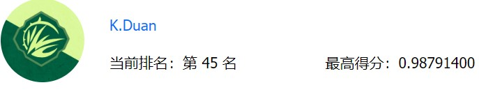
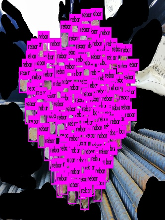

# Rebar_Detect


## 介绍
[CCFDF 智能盘点-钢筋数量AI识别](https://www.datafountain.cn/competitions/332)


仓库文件路径组织如下：
```
rebar_detect/
    |->darknet/
    |    |->cfg
    |    |->data
    |    |->cv_list
    |    |->data_augment
    |    |->img_list
    |    |->labels
    |    |->original_img
    |    |->original_list
    |    |->test_list
    |    |->train_list
    |->examples
    |->include
    |->python
    |->src
    |->tools/
    |    |->gen_train_list_tools
    |    |->imgaug_tools
    |    |->submit_tools
    |->DataFountain/
    |    |->GLODON_ObjDet
    |    |->data_augment
```

## 安装
1. 下载代码

```
git clone https://github.com/vicwer/rebar_detect.git
```

2. 由于使用的darknet框架，没有任何依赖，所以下载代码后按照[官网](https://pjreddie.com/darknet/install/)方式编译就可以

## 比赛思路，实现过程，训练，预测
### 比赛思路
由于给定的数据集分辨率很高，而且图数量不算多，重要的是，算力有限，所以原图训练不适合。

由此，整体思路是每张图滑窗裁剪保存作为新的训练集，训练时使用裁剪后的图做多尺度训练，由于是全卷积网络，所以预测时可以用大分辨率检测。

### 实现过程
1. 准备数据
```
DataFountain/
    |    |->GLODON_ObjDet
    |    |    |->data_augment
    |    |    |->train_dataset
    |    |    |->train
    |    |    |->test_dataset
```
将下载的数据集解压到train文件夹，train_label.csv放在GLODON_ObjDet下。

2. 运行以下脚本生成图像img_label.txt，存放图像路径和标签：
```
cd tools/imgaug_tools/
python3 gen_img_and_label_list.py
```

3. 做CV:
```
cd tools/imgaug_tools/
python3 gen_cv_list.py
```

4. CV后选择四个文件做训练集，一个做验证集，然后做镜像翻转：
```
cd tools/imgaug_tools/
python3 data_augment.py
```

5. 将数据增广后的文件列表合并，做滑窗裁剪操作：
```
cd tools/imgaug_tools/
python3 img_cv.py
```

6. 将滑窗后的文件列表合并，转换成YOLO训练的格式：
```
cd tools/gen_train_list_tools/
python3 gen_train_list.py
```

7. 得到的文件列表shuffle

### 训练
1. anchor设定两种方式，聚类或者统计boxes最大最小值均分：
```
cd tools/imgaug_tools/
python3 kmeans.py
or
python3 find_max_min_box.py
```

2. cfg设置：
```
cd darknet/cfg/
vim rebar.data
train = {your path}
etc.
```

### 训练
```
vim yolov3-rebar.cfg
# batch = 1
# subdivsions = 1
batch = 64
subdivsions = 32
width = 416
height = 416
./darknet detector train cfg/rebar.data cfg/yolov3-rebar.cfg -gpus 0,1,2,3
```

### 预测
```
cd darknet/cfg/
vim yolov3-rebar.cfg
batch = 1
subdivsions = 1
# batch = 64
# subdivsions = 32
width = 1504
height = 1504
./darknet detector test cfg/rebar.data cfg/yolov3-rebar.cfg {model} {img_path}
```

## 结果




## 其他
1. 训练图像的尺寸必须是32的倍数

2. 修改训练尺寸在"darknet/examples/detector.c"的line65, line66

3. darknet预训练模型可在darknet官网下载，我训练时没用预训练模型，应该不影响精度

4. 如有疑问，可issue

5. 引文：
```
@article{yolov3,
  title={YOLOv3: An Incremental Improvement},
  author={Redmon, Joseph and Farhadi, Ali},
  journal = {arXiv},
  year={2018}
}
```
